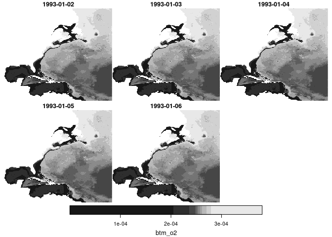

CEFI
================

[NOAA’s Physical Science Laboratory (PSL)](https://psl.noaa.gov/)
[Climate Ecosystems and Fisheries Initiative
Portal](https://psl.noaa.gov/cefi_portal/) serves historical and
forecast data useful in ecological studies. Data is served using a
[THREDDS](https://psl.noaa.gov/thredds/catalog/Projects/CEFI/regional_mom6/catalog.html)
catalog, but PSL also makes [tabular
catalogs](https://psl.noaa.gov/cefi_portal/var_list_northwest_atlantic_hist_run.html)
available, too.

# Requirements

- [R v4.1+](https://www.r-project.org/)
- [rlang](https://CRAN.R-project.org/package=rlang)
- [dplyr](https://CRAN.R-project.org/package=dplyr)
- [sf](https://CRAN.R-project.org/package=sf)
- [stars](https://CRAN.R-project.org/package=stars)
- [jsonlite](https://CRAN.R-project.org/package=jsonlite)
- [tidync](https://CRAN.R-project.org/package=tidync)

# Installation

    remotes::install_github("BigelowLab/cefi")

# Usage

Load the libraries needed.

``` r
suppressPackageStartupMessages({
  library(cefi)
  library(tidync)
  library(stars)
  library(dplyr)
})
```

## Catalogs

``` r
uri = catalog_uri(region = "Northwest Atlantic", period = "history")
hist = read_catalog(uri) |>
  dplyr::glimpse()
```

    ## Rows: 42
    ## Columns: 6
    ## $ Varible_Name     <chr> "siconc", "btm_o2", "chlos", "dissicos", "talkos", "s…
    ## $ Output_Frequency <chr> "monthly", "daily", "monthly", "monthly", "monthly", …
    ## $ Long_Name        <chr> "ice concentration", "Bottom Oxygen", "Surface Mass C…
    ## $ Unit             <chr> "0-1", "mol kg-1", "kg m-3", "mol m-3", "mol m-3", "m…
    ## $ File_Name        <chr> "ice_monthly.199301-201912.siconc.nc", "ocean_cobalt_…
    ## $ OPeNDAP_URL      <chr> "http://psl.noaa.gov/thredds/dodsC/Projects/CEFI/regi…

``` r
uri = catalog_uri(region = "Northwest Atlantic", period = "forecast")
fcst = read_catalog(uri) |>
  dplyr::glimpse()
```

    ## Rows: 480
    ## Columns: 6
    ## $ Varible_Name           <chr> "tob", "tob_anom", "tob", "tob_anom", "tob", "t…
    ## $ Time_of_Initialization <chr> "1993-03", "1993-03", "1993-06", "1993-06", "19…
    ## $ Long_Name              <chr> "Sea Water Potential Temperature at Sea Floor",…
    ## $ Unit                   <chr> "degC", "No unit provided in netCDF", "degC", "…
    ## $ File_Name              <chr> "tob_forecast_i199303.nc", "tob_forecast_i19930…
    ## $ OPeNDAP_URL            <chr> "http://psl.noaa.gov/thredds/dodsC/Projects/CEF…

# Getting data

To get data select one row from either catalog, and open that resource.

``` r
nc = hist |>
  dplyr::filter(Varible_Name == "btm_o2") |>
  open_cefi()
```

    ## not a file: 
    ## ' http://psl.noaa.gov/thredds/dodsC/Projects/CEFI/regional_mom6/northwest_atlantic/hist_run/ocean_cobalt_daily_2d.19930101-20191231.btm_o2.nc '
    ## 
    ## ... attempting remote connection

    ## Connection succeeded.

``` r
nc
```

    ## 
    ## Data Source (1): ocean_cobalt_daily_2d.19930101-20191231.btm_o2.nc ...
    ## 
    ## Grids (6) <dimension family> : <associated variables> 
    ## 
    ## [1]   D2,D3,D0 : btm_o2    **ACTIVE GRID** ( 6457722375  values per variable)
    ## [2]   D1,D0    : time_bnds
    ## [3]   D0       : average_DT, average_T1, average_T2, time
    ## [4]   D1       : nv
    ## [5]   D2       : xh
    ## [6]   D3       : yh
    ## 
    ## Dimensions 4 (3 active): 
    ##   
    ##   dim   name  length    min    max start count   dmin   dmax unlim coord_dim 
    ##   <chr> <chr>  <dbl>  <dbl>  <dbl> <int> <int>  <dbl>  <dbl> <lgl> <lgl>     
    ## 1 D0    time    9861   0.5  9860.      1  9861   0.5  9860.  TRUE  TRUE      
    ## 2 D2    xh       775 -98     -36.1     1   775 -98     -36.1 FALSE TRUE      
    ## 3 D3    yh       845   5.27   51.9     1   845   5.27   51.9 FALSE TRUE      
    ##   
    ## Inactive dimensions:
    ##   
    ##   dim   name  length   min   max unlim coord_dim 
    ##   <chr> <chr>  <dbl> <dbl> <dbl> <lgl> <lgl>     
    ## 1 D1    nv         2     1     2 FALSE TRUE

Next we filter the array, so that we can collect a subset of the data.
This “overwrites” the original object, by tagging those dimensions we
filter on with basic array navigation information that matches out
request. You can see the change in the `dim` and `max` values of the
active dimensions.

``` r
nc = tidync::hyper_filter(nc, time = dplyr::between(time, 1,6))
nc
```

    ## 
    ## Data Source (1): ocean_cobalt_daily_2d.19930101-20191231.btm_o2.nc ...
    ## 
    ## Grids (6) <dimension family> : <associated variables> 
    ## 
    ## [1]   D2,D3,D0 : btm_o2    **ACTIVE GRID** ( 6457722375  values per variable)
    ## [2]   D1,D0    : time_bnds
    ## [3]   D0       : average_DT, average_T1, average_T2, time
    ## [4]   D1       : nv
    ## [5]   D2       : xh
    ## [6]   D3       : yh
    ## 
    ## Dimensions 4 (3 active): 
    ##   
    ##   dim   name  length    min    max start count   dmin  dmax unlim coord_dim 
    ##   <chr> <chr>  <dbl>  <dbl>  <dbl> <int> <int>  <dbl> <dbl> <lgl> <lgl>     
    ## 1 D0    time    9861   0.5  9860.      2     5   1.5    5.5 TRUE  TRUE      
    ## 2 D2    xh       775 -98     -36.1     1   775 -98    -36.1 FALSE TRUE      
    ## 3 D3    yh       845   5.27   51.9     1   845   5.27  51.9 FALSE TRUE      
    ##   
    ## Inactive dimensions:
    ##   
    ##   dim   name  length   min   max unlim coord_dim 
    ##   <chr> <chr>  <dbl> <dbl> <dbl> <lgl> <lgl>     
    ## 1 D1    nv         2     1     2 FALSE TRUE

``` r
s = cefi_var(nc)
plot(s)
```

    ## downsample set to 2

<!-- -->
