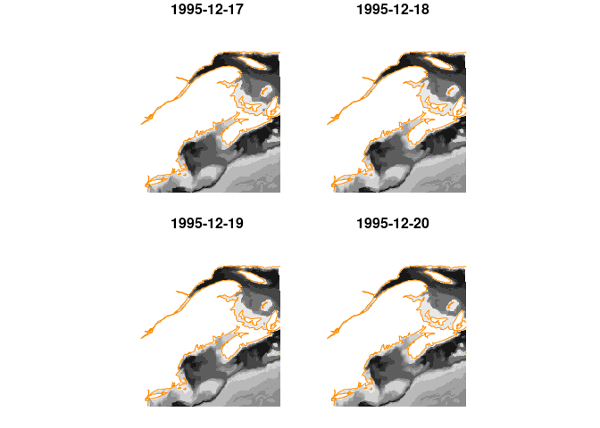
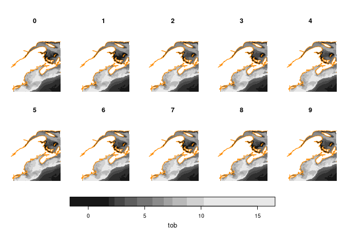

CEFI
================

[NOAA’s Physical Science Laboratory (PSL)](https://psl.noaa.gov/)
[Climate Ecosystems and Fisheries Initiative
Portal](https://psl.noaa.gov/cefi_portal/) serves historical and
forecast data useful in ecological studies. Data is served using a
[THREDDS](https://psl.noaa.gov/thredds/catalog/Projects/CEFI/regional_mom6/catalog.html)
catalog, but PSL also makes [tabular
catalogs](https://psl.noaa.gov/cefi_portal/var_list_northwest_atlantic_hist_run.html)
available, too.

# Requirements

- [R v4.1+](https://www.r-project.org/)
- [rlang](https://CRAN.R-project.org/package=rlang)
- [dplyr](https://CRAN.R-project.org/package=dplyr)
- [sf](https://CRAN.R-project.org/package=sf)
- [stars](https://CRAN.R-project.org/package=stars)
- [jsonlite](https://CRAN.R-project.org/package=jsonlite)
- [tidync](https://CRAN.R-project.org/package=tidync)

# Installation

    remotes::install_github("BigelowLab/cefi")

# Usage

Load the libraries needed.

``` r
suppressPackageStartupMessages({
  library(rnaturalearth)
  library(cefi)
  library(tidync)
  library(stars)
  library(dplyr)
})
```

## Catalogs

CEFI offers THREDDS catalogs which are great for mining
programmatically, but they also provide simple tabular catalogs: one for
historical runs and one for forecasts. (Yes, the first variable is
“Varible_Name”.) These are easy for users to navigate.

``` r
uri = catalog_uri(region = "Northwest Atlantic", period = "history")
hist = read_catalog(uri) |>
  dplyr::glimpse()
```

    ## Rows: 51
    ## Columns: 6
    ## $ Variable_Name    <chr> "tos", "ssu_rotate", "ssu", "ssh", "sos", "sob", "tob…
    ## $ Output_Frequency <chr> "daily", "daily", "daily", "daily", "daily", "daily",…
    ## $ Long_Name        <chr> "Sea Surface Temperature", "Sea Surface Zonal Velocit…
    ## $ Unit             <chr> "degC", "m s-1", "m s-1", "m", "psu", "psu", "degC", …
    ## $ File_Name        <chr> "ocean_daily.19930101-20191231.tos.nc", "ocean_daily.…
    ## $ OPeNDAP_URL      <chr> "http://psl.noaa.gov/thredds/dodsC/Projects/CEFI/regi…

``` r
uri = catalog_uri(region = "Northwest Atlantic", period = "forecast")
fcst = read_catalog(uri) |>
  dplyr::glimpse()
```

    ## Rows: 480
    ## Columns: 6
    ## $ Variable_Name          <chr> "tob", "tob_anom", "tob", "tob_anom", "tob", "t…
    ## $ Time_of_Initialization <chr> "1993-03", "1993-03", "1993-06", "1993-06", "19…
    ## $ Long_Name              <chr> "Sea Water Potential Temperature at Sea Floor",…
    ## $ Unit                   <chr> "degC", "No unit provided in netCDF", "degC", "…
    ## $ File_Name              <chr> "tob_forecast_i199303.nc", "tob_forecast_i19930…
    ## $ OPeNDAP_URL            <chr> "http://psl.noaa.gov/thredds/dodsC/Projects/CEF…

Assuming these catalogs will remain and stay up-to-date, we can leverage
them in lieu of coding up software to navigate the THREDDS catalogs.

# Getting data

To get data select one row from either catalog, and open that resource
which we see in R as a [tidync](https://docs.ropensci.org/tidync/)
object useful for navigating and extracting netcdf files.

### Historical data

Let’s start with historical data.

``` r
nc = hist |>
  dplyr::filter(Variable_Name == "btm_o2") |>
  cefi_open()
nc
```

    ## 
    ## Data Source (1): ocean_cobalt_daily_2d.19930101-20191231.btm_o2.nc ...
    ## 
    ## Grids (6) <dimension family> : <associated variables> 
    ## 
    ## [1]   D2,D3,D0 : btm_o2    **ACTIVE GRID** ( 6457722375  values per variable)
    ## [2]   D1,D0    : time_bnds
    ## [3]   D0       : average_DT, average_T1, average_T2, time
    ## [4]   D1       : nv
    ## [5]   D2       : xh
    ## [6]   D3       : yh
    ## 
    ## Dimensions 4 (3 active): 
    ##   
    ##   dim   name  length    min    max start count   dmin   dmax unlim coord_dim 
    ##   <chr> <chr>  <dbl>  <dbl>  <dbl> <int> <int>  <dbl>  <dbl> <lgl> <lgl>     
    ## 1 D0    time    9861   0.5  9860.      1  9861   0.5  9860.  TRUE  TRUE      
    ## 2 D2    xh       775 -98     -36.1     1   775 -98     -36.1 FALSE TRUE      
    ## 3 D3    yh       845   5.27   51.9     1   845   5.27   51.9 FALSE TRUE      
    ##   
    ## Inactive dimensions:
    ##   
    ##   dim   name  length   min   max unlim coord_dim 
    ##   <chr> <chr>  <dbl> <dbl> <dbl> <lgl> <lgl>     
    ## 1 D1    nv         2     1     2 FALSE TRUE

Note that the spatial dimensions of the “active” grid are defined by
`xh` nd `yh` not `x` and `y` or `lon` and `lat`. That is a choice of the
creator of the NetCDF resource, and so we use those names for filtering.

Time requires some background understanding of the CEFI architecture
coupled with the `tidync` approach to navigating the NetCDF object. To
ease that for the user we have created a function called `cefi_time()`
which is a wrapper around `tidync::hyper_transforms()`, but adds a
column called `time_` which can be either ‘Date’ of ‘POSIXct’ class.

``` r
cefi_time(nc)
```

    ## # A tibble: 9,861 × 8
    ##     time timestamp           index    id name  coord_dim selected time_     
    ##    <dbl> <chr>               <int> <int> <chr> <lgl>     <lgl>    <date>    
    ##  1   0.5 1993-01-01 12:00:00     1     0 time  TRUE      TRUE     1993-01-01
    ##  2   1.5 1993-01-02 12:00:00     2     0 time  TRUE      TRUE     1993-01-02
    ##  3   2.5 1993-01-03 12:00:00     3     0 time  TRUE      TRUE     1993-01-03
    ##  4   3.5 1993-01-04 12:00:00     4     0 time  TRUE      TRUE     1993-01-04
    ##  5   4.5 1993-01-05 12:00:00     5     0 time  TRUE      TRUE     1993-01-05
    ##  6   5.5 1993-01-06 12:00:00     6     0 time  TRUE      TRUE     1993-01-06
    ##  7   6.5 1993-01-07 12:00:00     7     0 time  TRUE      TRUE     1993-01-07
    ##  8   7.5 1993-01-08 12:00:00     8     0 time  TRUE      TRUE     1993-01-08
    ##  9   8.5 1993-01-09 12:00:00     9     0 time  TRUE      TRUE     1993-01-09
    ## 10   9.5 1993-01-10 12:00:00    10     0 time  TRUE      TRUE     1993-01-10
    ## # ℹ 9,851 more rows

Next we filter the array with `cefi_filter()`, so that we can collect a
subset of the data. This function is a wrapper around the
`tidync::hyper_filter()` function; we wrap because the time coordinate
in the NetCDF files is not in user-friendly format. Note that it is
important that `time` comes before any other filtering element.

``` r
nc = cefi_filter(nc, 
                 time = as.Date(c("1995-12-16", "1995-12-20")), 
                 xh = xh > -75 & xh < -60,
                 yh = yh > 40 & yh < 50)
```

It is important to understand that the actual data is not loaded into R
(yet), think of this a prefiltering step. To actually get the data we
can call `cefi_var`. You can explore more about prefiltering at the
[tidync website](https://docs.ropensci.org/tidync/).

Now we can load the data into R, using `cefi_var()`.

``` r
s = cefi_var(nc)
s
```

    ## stars object with 3 dimensions and 1 attribute
    ## attribute(s):
    ##                 Min.      1st Qu.       Median         Mean      3rd Qu.
    ## btm_o2  3.396523e-06 0.0001841419 0.0002342721 0.0002335193 0.0002703759
    ##                 Max.   NA's
    ## btm_o2  0.0003805129 125804
    ## dimension(s):
    ##      from  to     offset  delta refsys point                      values x/y
    ## X1      1 187         NA     NA WGS 84 FALSE [187x264] -75.46,...,-60.08 [x]
    ## X2      1 264         NA     NA WGS 84 FALSE    [187x264] 40.04,...,52.3 [y]
    ## time    1   4 1995-12-17 1 days   Date    NA                        NULL    
    ## curvilinear grid

And finally we can plot the result.

``` r
coast = rnaturalearth::ne_coastline(scale = "medium", returnclass = "sf") |>
  sf::st_geometry() |>
  sf::st_crop(sf::st_bbox(s)) 

plot_coast = function(){
  plot(sf::st_geometry(coast), add = TRUE, col = "darkorange")
}

plot(s, hook = plot_coast, key.pos = NULL)
```

<!-- -->

### Forecast data

Now let’s look at forecast data.

``` r
nc = fcst |>
  dplyr::filter(Variable_Name == "tob" & Time_of_Initialization == "2022-12") |>
  cefi_open()

nc
```

    ## 
    ## Data Source (1): tob_forecast_i202212.nc ...
    ## 
    ## Grids (5) <dimension family> : <associated variables> 
    ## 
    ## [1]   D2,D3,D0,D1 : tob, tob_anom    **ACTIVE GRID** ( 78585000  values per variable)
    ## [2]   D0          : lead
    ## [3]   D1          : member
    ## [4]   D2          : xh
    ## [5]   D3          : yh
    ## 
    ## Dimensions 4 (all active): 
    ##   
    ##   dim   name   length    min   max start count   dmin  dmax unlim coord_dim 
    ##   <chr> <chr>   <dbl>  <dbl> <dbl> <int> <int>  <dbl> <dbl> <lgl> <lgl>     
    ## 1 D0    lead       12   0     11       1    12   0     11   FALSE TRUE      
    ## 2 D1    member     10   1     10       1    10   1     10   FALSE TRUE      
    ## 3 D2    xh        775 -98    -36.1     1   775 -98    -36.1 FALSE TRUE      
    ## 4 D3    yh        845   5.27  51.9     1   845   5.27  51.9 FALSE TRUE

Here time is measured in `lead` time (in months) relative to an
initalization date. But note that the actually time varying dimension is
called `lead` even though we address it in the more familiar `time`.
Once again we can use `cefi_time()` to expose the time-varying dimension
relative to the starting date.

``` r
cefi_time(nc)
```

    ## # A tibble: 12 × 7
    ##     lead index    id name  coord_dim selected time_     
    ##    <dbl> <int> <int> <chr> <lgl>     <lgl>    <date>    
    ##  1     0     1     0 lead  TRUE      TRUE     1994-12-01
    ##  2     1     2     0 lead  TRUE      TRUE     1995-01-01
    ##  3     2     3     0 lead  TRUE      TRUE     1995-02-01
    ##  4     3     4     0 lead  TRUE      TRUE     1995-03-01
    ##  5     4     5     0 lead  TRUE      TRUE     1995-04-01
    ##  6     5     6     0 lead  TRUE      TRUE     1995-05-01
    ##  7     6     7     0 lead  TRUE      TRUE     1995-06-01
    ##  8     7     8     0 lead  TRUE      TRUE     1995-07-01
    ##  9     8     9     0 lead  TRUE      TRUE     1995-08-01
    ## 10     9    10     0 lead  TRUE      TRUE     1995-09-01
    ## 11    10    11     0 lead  TRUE      TRUE     1995-10-01
    ## 12    11    12     0 lead  TRUE      TRUE     1995-11-01

``` r
nc = cefi_filter(nc, 
                 time = as.Date(c("1994-12-01", "1995-02-01")), 
                 xh = xh > -75 & xh < -60,
                 yh = yh > 40 & yh < 50)
```

Unlike the historical runs, the forecast results include one or more
ensemble member results for each time period. These are identified as
`member` which you might think of as replicates. Requesting all members
for a given time is certainly possible, but probably a more common use
case is to extract a summary (mean or median) or a measure of
variability (standard deviation or variance).

``` r
s = cefi_var(nc)
s
```

    ## stars object with 3 dimensions and 2 attributes
    ## attribute(s):
    ##                Min.   1st Qu.   Median     Mean  3rd Qu.      Max.  NA's
    ## tob       -1.620881 2.5111211 5.615224 5.487276 7.851473 15.637622 94353
    ## tob_anom  -5.943011 0.1601234 1.041166 1.000913 1.577987  4.219558 94353
    ## dimension(s):
    ##      from  to refsys point                             values x/y
    ## X1      1 187 WGS 84 FALSE        [187x264] -75.46,...,-60.08 [x]
    ## X2      1 264 WGS 84 FALSE           [187x264] 40.04,...,52.3 [y]
    ## time    1   3   Date    NA 1995-01-01, 1995-02-01, 1995-03-01    
    ## curvilinear grid

In this case, there are two variables, `tob` (temperature of bottom) and
`tob_anom` temperature of bottom anomaly.

``` r
plot(s['tob'], hook = plot_coast)
```

<!-- -->
