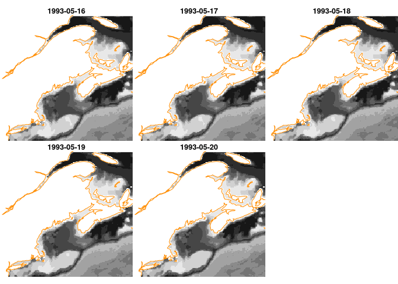
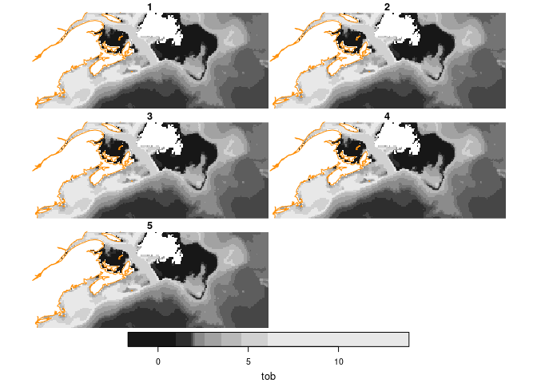
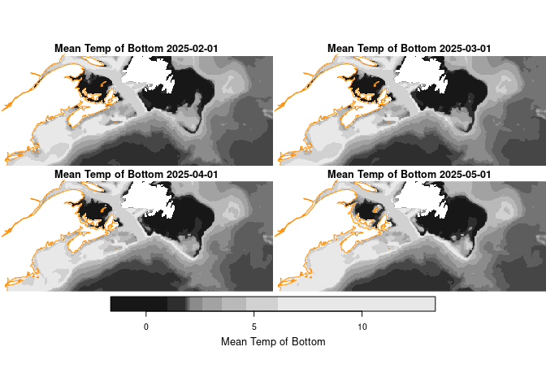
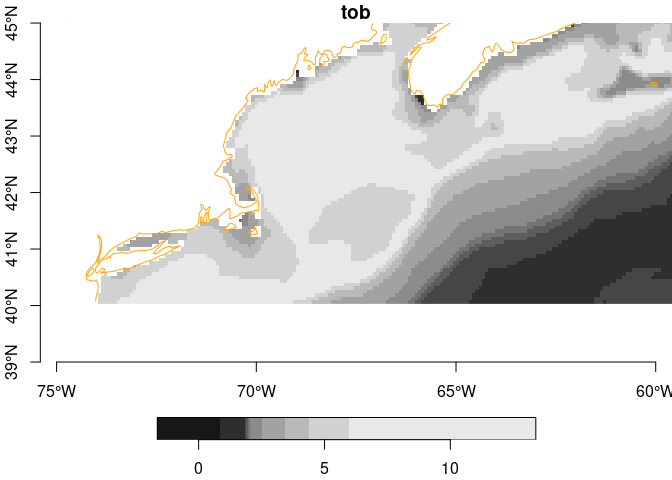

CEFI
================

[NOAA’s Physical Science Laboratory (PSL)](https://psl.noaa.gov/)
[Changing Ecosystems and Fisheries Initiative
Portal](https://psl.noaa.gov/cefi_portal/) serves historical and
forecast data useful in ecological studies. Data is served using a
[THREDDS](https://psl.noaa.gov/thredds/catalog/Projects/CEFI/regional_mom6/cefi_portal/catalog.html)
catalog, but PSL also makes [tabular variable
catalogs](https://psl.noaa.gov/cefi_portal/#data_access) available, too.

### Variable Catalogs (“catalogs”)

This package leverages the variable catalog listings to access ointers
to data sets. This system works well, but we are reliant on the catalog
matching the data products offered. Catalogs are organized by region
(“nwa”, “nep”, *etc*) and by experiment type (“hindcast”,
“seasonal_forecast”, “seasonal_reforecast”, *etc*).

### THREDDS

If you wish to use a THREDDS catalog service try the [cefitds R
package](https://github.com/BigelowLab/cefitds). Keep in mind that the
THREDDS catalog is used for searching for data (programmatically), but
once you have found the data, you will want to bring your findings back
here to use this package to access the data.

### OPeNDAP/NETCDF

Ultimately, you will use the search tools here to access a URL to an
OPeNDAP resource (NETCDF). There are many tools for accessing
OPeNDAP/NETCDF data, but for this work we have chosen
[tidync](https://CRAN.R-project.org/package=tidync), but
[ncdf4](https://CRAN.R-project.org/package=ncdf4) and others could work
as well.

# Requirements

- [R v4.1+](https://www.r-project.org/)
- [rlang](https://CRAN.R-project.org/package=rlang)
- [dplyr](https://CRAN.R-project.org/package=dplyr)
- [sf](https://CRAN.R-project.org/package=sf)
- [stars](https://CRAN.R-project.org/package=stars)
- [jsonlite](https://CRAN.R-project.org/package=jsonlite)
- [tidync](https://CRAN.R-project.org/package=tidync)

# Installation

    remotes::install_github("BigelowLab/cefi")

# Usage

Load the libraries needed.

``` r
suppressPackageStartupMessages({
  library(rnaturalearth)
  library(cefi)
  library(tidync)
  library(stars)
  library(dplyr)
})
```

## Catalogs

CEFI offers THREDDS catalogs which are great for mining
programmatically, but they also provide simple tabular catalogs:
hindcast, seasonal_reforecast, seasonal_forecast.

### Hindcast

``` r
uri = catalog_uri(region = "northwest_atlantic", xcast = "hindcast")
hindcast = read_catalog(uri) |>
  dplyr::glimpse()
```

    ## Rows: 1,958
    ## Columns: 24
    ## $ cefi_filename         <chr> "btm_co3_ion.nwa.full.hcast.daily.raw.r20250715.…
    ## $ cefi_variable         <chr> "btm_co3_ion", "btm_co3_sol_arag", "btm_co3_sol_…
    ## $ cefi_long_name        <chr> "Bottom Carbonate Ion", "Bottom Aragonite Solubi…
    ## $ cefi_unit             <chr> "mol kg-1", "mol kg-1", "mol kg-1", "mol kg-1", …
    ## $ cefi_output_frequency <chr> "daily", "daily", "daily", "daily", "daily", "da…
    ## $ cefi_grid_type        <chr> "raw", "raw", "raw", "raw", "raw", "raw", "raw",…
    ## $ cefi_rel_path         <chr> "cefi_portal/northwest_atlantic/full_domain/hind…
    ## $ cefi_ori_filename     <chr> "ocean_cobalt_daily_2d.19930101-20231231.btm_co3…
    ## $ cefi_ori_category     <chr> "ocean_cobalt_daily_2d", "ocean_cobalt_daily_2d"…
    ## $ cefi_archive_version  <chr> "/archive/acr/fre/NWA/2025_04/NWA12_COBALT_2025_…
    ## $ cefi_run_xml          <chr> NA, NA, NA, NA, NA, NA, NA, NA, NA, NA, NA, NA, …
    ## $ cefi_region           <chr> "nwa", "nwa", "nwa", "nwa", "nwa", "nwa", "nwa",…
    ## $ cefi_subdomain        <chr> "full", "full", "full", "full", "full", "full", …
    ## $ cefi_experiment_type  <chr> "hindcast", "hindcast", "hindcast", "hindcast", …
    ## $ cefi_experiment_name  <chr> "nwa12_cobalt_v2", "nwa12_cobalt_v2", "nwa12_cob…
    ## $ cefi_release          <chr> "r20250715", "r20250715", "r20250715", "r2025071…
    ## $ cefi_date_range       <chr> "199301-202312", "199301-202312", "199301-202312…
    ## $ cefi_init_date        <chr> NA, NA, NA, NA, NA, NA, NA, NA, NA, NA, NA, NA, …
    ## $ cefi_ensemble_info    <chr> NA, NA, NA, NA, NA, NA, NA, NA, NA, NA, NA, NA, …
    ## $ cefi_forcing          <chr> NA, NA, NA, NA, NA, NA, NA, NA, NA, NA, NA, NA, …
    ## $ cefi_data_doi         <chr> "10.5281/zenodo.7893386", "10.5281/zenodo.789338…
    ## $ cefi_paper_doi        <chr> "10.5194/gmd-16-6943-2023", "10.5194/gmd-16-6943…
    ## $ cefi_aux              <chr> NA, NA, NA, NA, NA, NA, NA, NA, NA, NA, NA, NA, …
    ## $ cefi_opendap          <chr> "http://psl.noaa.gov/thredds/dodsC/Projects/CEFI…

One thing to note is that as of Spring 2025 two forms of each grid are
provided: “raw” and “regrid”.

``` r
count(hindcast, cefi_grid_type)
```

    ## # A tibble: 2 × 2
    ##   cefi_grid_type     n
    ##   <chr>          <int>
    ## 1 raw              979
    ## 2 regrid           979

``` r
uri = catalog_uri(region = "northwest_atlantic", xcast = "seasonal_reforecast")
refcst = read_catalog(uri) |>
  dplyr::glimpse()
```

    ## Rows: 2,160
    ## Columns: 24
    ## $ cefi_filename         <chr> "sos.nwa.full.ss_refcast.monthly.raw.r20250212.e…
    ## $ cefi_variable         <chr> "sos", "sos", "sos", "sos", "sos", "sos", "sos",…
    ## $ cefi_long_name        <chr> "Sea Surface Salinity", "Sea Surface Salinity", …
    ## $ cefi_unit             <chr> "psu", "psu", "psu", "psu", "psu", "psu", "psu",…
    ## $ cefi_output_frequency <chr> "monthly", "monthly", "monthly", "monthly", "mon…
    ## $ cefi_grid_type        <chr> "raw", "raw", "raw", "raw", "raw", "raw", "raw",…
    ## $ cefi_rel_path         <chr> "cefi_portal/northwest_atlantic/full_domain/seas…
    ## $ cefi_archive_version  <chr> "/archive/Andrew.C.Ross/fre/NWA/2024_09/NWA12_co…
    ## $ cefi_run_xml          <chr> NA, NA, NA, NA, NA, NA, NA, NA, NA, NA, NA, NA, …
    ## $ cefi_region           <chr> "nwa", "nwa", "nwa", "nwa", "nwa", "nwa", "nwa",…
    ## $ cefi_subdomain        <chr> "full", "full", "full", "full", "full", "full", …
    ## $ cefi_experiment_type  <chr> "seasonal_reforecast", "seasonal_reforecast", "s…
    ## $ cefi_experiment_name  <chr> "nwa12_reforecast", "nwa12_reforecast", "nwa12_r…
    ## $ cefi_release          <chr> "r20250212", "r20250212", "r20250212", "r2025021…
    ## $ cefi_date_range       <chr> NA, NA, NA, NA, NA, NA, NA, NA, NA, NA, NA, NA, …
    ## $ cefi_init_date        <chr> "i199402", "i199406", "i199409", "i199412", "i19…
    ## $ cefi_ensemble_info    <chr> "enss", "enss", "enss", "enss", "enss", "enss", …
    ## $ cefi_forcing          <chr> NA, NA, NA, NA, NA, NA, NA, NA, NA, NA, NA, NA, …
    ## $ cefi_data_doi         <chr> "10.5281/zenodo.10642295", "10.5281/zenodo.10642…
    ## $ cefi_paper_doi        <chr> "10.5194/egusphere-2024-394", "10.5194/egusphere…
    ## $ cefi_aux              <chr> "archive format yyyy-mm-e## represents the initi…
    ## $ cefi_ori_filename     <chr> "ocean_monthly.variable.nc", "ocean_monthly.vari…
    ## $ cefi_ori_category     <chr> "ocean_monthly", "ocean_monthly", "ocean_monthly…
    ## $ cefi_opendap          <chr> "http://psl.noaa.gov/thredds/dodsC/Projects/CEFI…

``` r
uri = catalog_uri(region = "northwest_atlantic", xcast = "seasonal_forecast")
fcst = read_catalog(uri) |>
  dplyr::glimpse()
```

    ## Rows: 128
    ## Columns: 24
    ## $ cefi_filename         <chr> "sos.nwa.full.ss_fcast.monthly.raw.r20250212.ens…
    ## $ cefi_variable         <chr> "sos", "tob", "tos", "MLD_003", "MLD_003", "MLD_…
    ## $ cefi_long_name        <chr> "Sea Surface Salinity", "Sea Water Potential Tem…
    ## $ cefi_unit             <chr> "psu", "degC", "degC", "m", "m", "m", "mol kg-1"…
    ## $ cefi_output_frequency <chr> "monthly", "monthly", "monthly", "monthly", "mon…
    ## $ cefi_grid_type        <chr> "raw", "raw", "raw", "raw", "raw", "raw", "raw",…
    ## $ cefi_rel_path         <chr> "cefi_portal/northwest_atlantic/full_domain/seas…
    ## $ cefi_archive_version  <chr> "/archive/Andrew.C.Ross/fre/NWA/2024_09/NWA12_co…
    ## $ cefi_run_xml          <chr> NA, NA, NA, NA, NA, NA, NA, NA, NA, NA, NA, NA, …
    ## $ cefi_region           <chr> "nwa", "nwa", "nwa", "nwa", "nwa", "nwa", "nwa",…
    ## $ cefi_subdomain        <chr> "full", "full", "full", "full", "full", "full", …
    ## $ cefi_experiment_type  <chr> "seasonal_forecast", "seasonal_forecast", "seaso…
    ## $ cefi_experiment_name  <chr> "nwa12_forecast", "nwa12_forecast", "nwa12_forec…
    ## $ cefi_release          <chr> "r20250212", "r20250212", "r20250212", "r2025071…
    ## $ cefi_date_range       <chr> NA, NA, NA, NA, NA, NA, NA, NA, NA, NA, NA, NA, …
    ## $ cefi_init_date        <chr> "i202502", "i202502", "i202502", "i202510", "i20…
    ## $ cefi_ensemble_info    <chr> "enss", "enss", "enss", "enss", "enss", "enss", …
    ## $ cefi_forcing          <chr> NA, NA, NA, NA, NA, NA, NA, NA, NA, NA, NA, NA, …
    ## $ cefi_data_doi         <chr> "10.5281/zenodo.10642295", "10.5281/zenodo.10642…
    ## $ cefi_paper_doi        <chr> "10.5194/egusphere-2024-394", "10.5194/egusphere…
    ## $ cefi_aux              <chr> "archive format yyyy-mm-e## represents the initi…
    ## $ cefi_ori_filename     <chr> "ocean_monthly.variable.nc", "ocean_monthly.vari…
    ## $ cefi_ori_category     <chr> "ocean_monthly", "ocean_monthly", "ocean_monthly…
    ## $ cefi_opendap          <chr> "http://psl.noaa.gov/thredds/dodsC/Projects/CEFI…

Assuming these catalogs will remain and stay up-to-date, we can leverage
them in lieu of coding up software to navigate the THREDDS catalogs.

# Getting data

To get data select one row from either catalog, and open that resource
which we see in R as a [tidync](https://docs.ropensci.org/tidync/)
object useful for navigating and extracting netcdf files.

### Historical data

Let’s start with historical data.

``` r
nc = hindcast |>
  dplyr::filter(cefi_variable == "btm_o2", 
                cefi_grid_type == "regrid",
                cefi_output_frequency == "daily") |>
  cefi_open()
nc
```

    ## 
    ## Data Source (1): btm_o2.nwa.full.hcast.daily.regrid.r20230520.199301-201912.nc ...
    ## 
    ## Grids (4) <dimension family> : <associated variables> 
    ## 
    ## [1]   D1,D0,D2 : btm_o2    **ACTIVE GRID** ( 6441757416  values per variable)
    ## [2]   D0       : lat
    ## [3]   D1       : lon
    ## [4]   D2       : time
    ## 
    ## Dimensions 3 (all active): 
    ##   
    ##   dim   name  length    min    max start count   dmin   dmax unlim coord_dim 
    ##   <chr> <chr>  <dbl>  <dbl>  <dbl> <int> <int>  <dbl>  <dbl> <lgl> <lgl>     
    ## 1 D0    lat      844   5.27   58.2     1   844   5.27   58.2 FALSE TRUE      
    ## 2 D1    lon      774 262.    324.      1   774 262.    324.  FALSE TRUE      
    ## 3 D2    time    9861   0.5  9860.      1  9861   0.5  9860.  FALSE TRUE

Time requires some background understanding of the CEFI architecture
coupled with the `tidync` approach to navigating the NetCDF object. To
ease that for the user we have created a function called `cefi_time()`
which is a wrapper around `tidync::hyper_transforms()`, but adds a
column called `time_` which can be either ‘Date’ of ‘POSIXct’ class.

``` r
cefi_time(nc)
```

    ## # A tibble: 9,861 × 8
    ##     time timestamp           index    id name  coord_dim selected time_     
    ##    <dbl> <chr>               <int> <int> <chr> <lgl>     <lgl>    <date>    
    ##  1   0.5 1993-01-01T12:00:00     1     2 time  TRUE      TRUE     1993-01-01
    ##  2   1.5 1993-01-02T12:00:00     2     2 time  TRUE      TRUE     1993-01-02
    ##  3   2.5 1993-01-03T12:00:00     3     2 time  TRUE      TRUE     1993-01-03
    ##  4   3.5 1993-01-04T12:00:00     4     2 time  TRUE      TRUE     1993-01-04
    ##  5   4.5 1993-01-05T12:00:00     5     2 time  TRUE      TRUE     1993-01-05
    ##  6   5.5 1993-01-06T12:00:00     6     2 time  TRUE      TRUE     1993-01-06
    ##  7   6.5 1993-01-07T12:00:00     7     2 time  TRUE      TRUE     1993-01-07
    ##  8   7.5 1993-01-08T12:00:00     8     2 time  TRUE      TRUE     1993-01-08
    ##  9   8.5 1993-01-09T12:00:00     9     2 time  TRUE      TRUE     1993-01-09
    ## 10   9.5 1993-01-10T12:00:00    10     2 time  TRUE      TRUE     1993-01-10
    ## # ℹ 9,851 more rows

Next we filter the array with `cefi_filter()`, so that we can collect a
subset of the data. This function is a wrapper around the
`tidync::hyper_filter()` function; we wrap because the time coordinate
in the NetCDF files is not in user-friendly format. Note that it is
important that `time` comes before any other filtering element.

``` r
nc = cefi_filter(nc, 
                 time = as.Date(c("1993-05-16", "1993-05-20")), 
                 lon = lon > 285 & lon < 300,
                 lat = lat > 40 & lat < 50)
```

It is important to understand that the actual data is not loaded into R
(yet), think of this a prefiltering step. To actually get the data we
can call `cefi_var`. You can explore more about prefiltering at the
[tidync website](https://docs.ropensci.org/tidync/).

Now we can load the data into R, using `cefi_var()`.

``` r
s = cefi_var(nc)
s
```

    ## stars object with 3 dimensions and 1 attribute
    ## attribute(s):
    ##                 Min.      1st Qu.       Median         Mean      3rd Qu.
    ## btm_o2  0.0001241896 0.0002053618 0.0002612149 0.0002465203 0.0002736389
    ##                 Max.  NA's
    ## btm_o2  0.0003573454 79435
    ## dimension(s):
    ##      from  to     offset   delta refsys point x/y
    ## x       1 186     -74.97 0.08068 WGS 84 FALSE [x]
    ## y       1 159      40.03 0.06274 WGS 84 FALSE [y]
    ## time    1   5 1993-05-16  1 days   Date    NA

And finally we can plot the result.

``` r
coast = rnaturalearth::ne_coastline(scale = "medium", returnclass = "sf") |>
  sf::st_geometry() |>
  sf::st_crop(sf::st_bbox(s)) 

plot_coast = function(){
  plot(sf::st_geometry(coast), add = TRUE, col = "darkorange")
}

plot(s, hook = plot_coast, key.pos = NULL)
```

<!-- -->

### Forecast data

Now let’s look at forecast data. Multiple versions are hosted, we are
interested in the most recent.

``` r
nc = fcst |>
  dplyr::filter(cefi_variable == "tob",
                cefi_grid_type == "regrid") |>
  dplyr::slice_tail(n=1)|>
  cefi_open()
nc
```

    ## 
    ## Data Source (1): tob.nwa.full.ss_fcast.monthly.regrid.r20250212.enss.i202502.nc ...
    ## 
    ## Grids (5) <dimension family> : <associated variables> 
    ## 
    ## [1]   D2,D0,D3,D1 : tob, tob_anom    **ACTIVE GRID** ( 39195360  values per variable)
    ## [2]   D0          : lat
    ## [3]   D1          : lead
    ## [4]   D2          : lon
    ## [5]   D3          : member
    ## 
    ## Dimensions 4 (all active): 
    ##   
    ##   dim   name   length    min   max start count   dmin  dmax unlim coord_dim 
    ##   <chr> <chr>   <dbl>  <dbl> <dbl> <int> <int>  <dbl> <dbl> <lgl> <lgl>     
    ## 1 D0    lat       844   5.27  58.2     1   844   5.27  58.2 FALSE TRUE      
    ## 2 D1    lead       12   0     11       1    12   0     11   FALSE TRUE      
    ## 3 D2    lon       774 -98    -36.1     1   774 -98    -36.1 FALSE TRUE      
    ## 4 D3    member      5   1      5       1     5   1      5   FALSE TRUE

Here time is measured in `lead` time (in months) relative to an
initalization date. But note that the actually time varying dimension is
called `lead` even though we address it in the more familiar `time`.
Once again we can use `cefi_time()` to expose the time-varying dimension
relative to the starting date.

``` r
tc = cefi_time(nc)
tc
```

    ## # A tibble: 12 × 7
    ##     lead index    id name  coord_dim selected time_     
    ##    <dbl> <int> <int> <chr> <lgl>     <lgl>    <date>    
    ##  1     0     1     1 lead  TRUE      TRUE     2025-02-01
    ##  2     1     2     1 lead  TRUE      TRUE     2025-03-01
    ##  3     2     3     1 lead  TRUE      TRUE     2025-04-01
    ##  4     3     4     1 lead  TRUE      TRUE     2025-05-01
    ##  5     4     5     1 lead  TRUE      TRUE     2025-06-01
    ##  6     5     6     1 lead  TRUE      TRUE     2025-07-01
    ##  7     6     7     1 lead  TRUE      TRUE     2025-08-01
    ##  8     7     8     1 lead  TRUE      TRUE     2025-09-01
    ##  9     8     9     1 lead  TRUE      TRUE     2025-10-01
    ## 10     9    10     1 lead  TRUE      TRUE     2025-11-01
    ## 11    10    11     1 lead  TRUE      TRUE     2025-12-01
    ## 12    11    12     1 lead  TRUE      TRUE     2026-01-01

Also note that we have ensemble ‘member’ is another dimension; it refers
to the ensemble identifying member number. These we can collapse, as
shown below, into a single layer for each time step.

``` r
nc = cefi_filter(nc, 
                 time = tc$time_[c(1,4)], 
                 lon = lon > -75 & lon < -40,
                 lat = lat > 40 & lat < 50)
```

Unlike the historical runs, the forecast results include one or more
ensemble member results for each time period. These are identified as
`member` which you might think of as replicates.

Here we show retrieving all of the members.

``` r
s = cefi_var(nc, collapse_fun = NULL)
s
```

    ## stars object with 4 dimensions and 2 attributes
    ## attribute(s), summary of first 1e+05 cells:
    ##                Min.     1st Qu.        Median        Mean    3rd Qu.      Max.
    ## tob       -1.679666  1.86432761  2.0082848072 2.990136862 3.81638414 13.438345
    ## tob_anom  -3.369996 -0.04102705 -0.0006299688 0.002296684 0.05280294  2.352964
    ##            NA's
    ## tob       22468
    ## tob_anom  22468
    ## dimension(s):
    ##        from  to offset   delta refsys point                    values x/y
    ## x         1 437 -74.93  0.0801 WGS 84 FALSE                      NULL [x]
    ## y         1 159  40.03 0.06274 WGS 84 FALSE                      NULL [y]
    ## member    1   5      1       1     NA FALSE                      NULL    
    ## time      1   4     NA      NA   Date    NA 2025-02-01,...,2025-05-01

To see the ensemble results for one date, we can slice-and-dice using
indexing.In this case, there are two variables, `tob` (temperature of
bottom) and `tob_anom` temperature of bottom anomaly. Below we show only
`tob`.

``` r
times = st_get_dimension_values(s, "time")
plot(s['tob'], hook = plot_coast)
```

    ## downsample set to 1

<!-- -->

Requesting all members for a given time is possible as shown above, but
a more common use case is to extract a summary (mean or median) or a
measure of variability (standard deviation or variance).

``` r
s = cefi_var(nc, collapse_fun = mean)
s
```

    ## stars object with 3 dimensions and 2 attributes
    ## attribute(s):
    ##                Min.     1st Qu.     Median       Mean   3rd Qu.      Max.  NA's
    ## tob       -1.640977  1.86412742 2.05090370 2.97297596 3.9318573 13.396392 75064
    ## tob_anom  -3.111446 -0.01932273 0.02077904 0.08140885 0.1525557  4.910501 75064
    ## dimension(s):
    ##      from  to offset   delta refsys point                    values x/y
    ## x       1 437 -74.93  0.0801 WGS 84 FALSE                      NULL [x]
    ## y       1 159  40.03 0.06274 WGS 84 FALSE                      NULL [y]
    ## time    1   4     NA      NA   Date    NA 2025-02-01,...,2025-05-01

Note that the dimensionality is reduced because we computed the mean of
the ensembles at each time.

``` r
plot(s['tob'], hook = plot_coast, main = "Mean Temp of Bottom")
```

<!-- -->

You may found it easier to work with a raster based on \[-180,180\]
longitudes. We provide a function to “shift” the raster to that range.

``` r
s = shift_stars(s)
```

### Granularity

Here we highlight the granularity of the data source by zooming in on
the New England coastline. You can see that large embayments such as
Penobscot and Narragansett bays are not included.

``` r
plot(dplyr::slice(s['tob'], "time",  1),
     xlim = c(-72 , -63),
     ylim = c(39, 45),
     reset = FALSE,
     axes = TRUE)
plot(coast, add = TRUE, col = "orange")
```

<!-- -->
