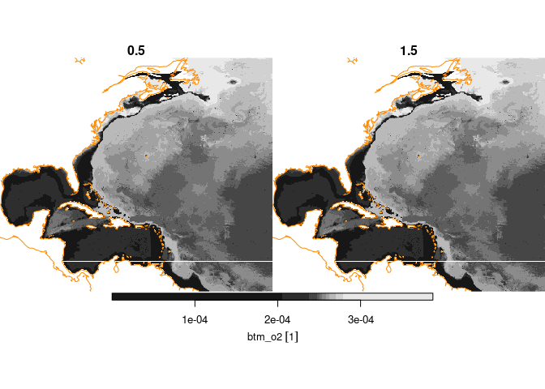
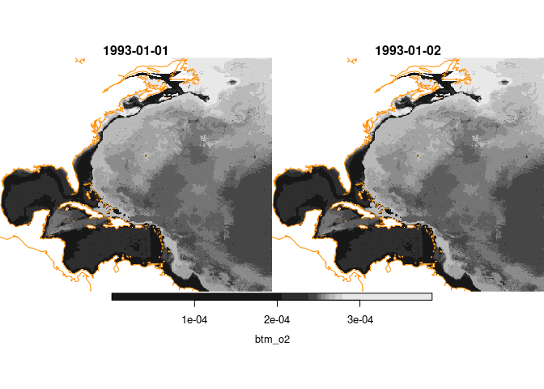
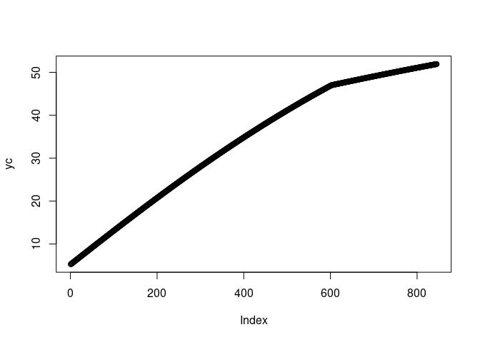
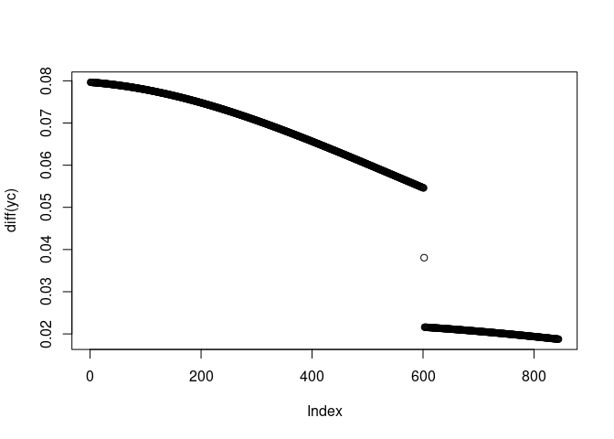

stars issues
================

Preliminaries…

``` r
suppressPackageStartupMessages({
  library(rnaturalearth)
  library(cefi)
  library(tidync)
  library(stars)
  library(dplyr)
})
uri = "http://psl.noaa.gov/thredds/dodsC/Projects/CEFI/regional_mom6/northwest_atlantic/hist_run/ocean_cobalt_daily_2d.19930101-20191231.btm_o2.nc"
tnc = tidync::tidync(uri) |>
  tidync::hyper_filter(time = time <= 2)
```

    ## not a file: 
    ## ' http://psl.noaa.gov/thredds/dodsC/Projects/CEFI/regional_mom6/northwest_atlantic/hist_run/ocean_cobalt_daily_2d.19930101-20191231.btm_o2.nc '
    ## 
    ## ... attempting remote connection

    ## Connection succeeded.

``` r
coast = rnaturalearth::ne_coastline(scale = "medium", returnclass = 'sf')
plot_coast = function(){
  plot(sf::st_geometry(coast), col = "darkorange", add = TRUE)
}
```

# Extract

## Using an adaption of [MS method](https://github.com/ropensci/tidync/issues/68#issuecomment-484773118)

This approach digs into unexported functions in both `stars` and
`tidync` packages.

``` r
s1 = tidync_as_stars(tnc) |>
  sf::st_set_crs(sf::st_crs(coast))
```

## Using the naive approach

This approach uses a simpler (but less robust) approach to building a
rectilinear grid.

``` r
s2 = cefi_var(tnc)
```

``` r
coast2 = coast
plot(s1, hook = plot_coast)
```

    ## downsample set to 1

<!-- -->

``` r
plot(s2, hook = plot_coast)
```

    ## downsample set to 1

<!-- -->

So, regardless of method we have something unexpected happening in the
St Lawrence River region.

# Examine the y-coordinates

Extract the coordinates and then plot the values, and then the
consecutive differences.

``` r
ax = tidync::hyper_transforms(tnc)
yc = ax[['yh']] |> dplyr::pull(1)
plot(yc)
```

<!-- -->

``` r
plot(diff(yc))
```

<!-- -->

Clearly something is going on starting at index 602 (47 degrees north)
